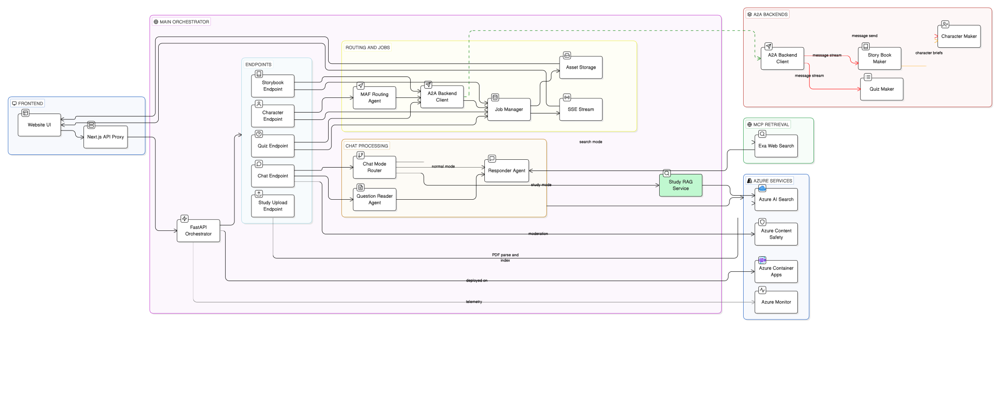

# Dream

An AI-powered storytelling platform for kids. Children and parents describe a story idea and Dream turns it into a fully illustrated storybook complete with named characters, hand-crafted backstories, scene illustrations, and a fixed 7-spread page layout ready to read.

The platform is built across four services that talk to each other using open protocols: a Next.js frontend, a MAF orchestration layer, a CrewAI character engine, and a MAF storybook engine. Every AI call goes through a proper agent, every backend call goes through A2A, web search grounding is handled through Exa MCP, and uploaded-study grounding is handled through Azure AI Search.

**Built with [Microsoft Agent Framework (MAF)](https://learn.microsoft.com/en-us/agent-framework/) a structured agent SDK that wraps OpenAI and Azure OpenAI behind typed `Agent` objects with named identities, system instructions, and tool-use support. No raw `openai.chat.completions` calls exist anywhere in this codebase. Every LLM interaction is an agent.**


### Architecture



### Service READMEs

Each service has a detailed README covering agents, endpoints, environment variables, request/response examples, and troubleshooting. Start here if you're working on a specific service.

| Service | Port | README |
|---------|------|--------|
| Main Orchestrator (MAF + MCP + A2A) | `8010` | [`backend/main-maf-chat/README.md`](backend/main-maf-chat/README.md) |
| Character Maker (CrewAI + A2A) | `8000` | [`backend/a2a-crew-ai-character-maker/README.md`](backend/a2a-crew-ai-character-maker/README.md) |
| Story Book Maker (MAF + A2A) | `8020` | [`backend/a2a-maf-story-book-maker/README.md`](backend/a2a-maf-story-book-maker/README.md) |
| Azure Search RAG Integration | — | [`backend/main-maf-chat/README.md`](backend/main-maf-chat/README.md) |

---

## What It Does

| Feature | What Happens |
|---------|-------------|
| **Kid-safe chat** | Kids ask questions, two MAF agents classify and answer. Search mode uses Exa MCP for fresh web results, and Study mode uses Azure AI Search over uploaded PDFs with citations. |
| **Character creation** | A prompt + optional drawings → Vision analysis → 4 CrewAI agents build a full character backstory and image prompt → Replicate renders the character illustration. |
| **Storybook generation** | A prompt → MAF agents write a story plan, chapter text, and scene prompts → character generation runs in parallel via A2A → Replicate renders cover + 5 scene images → fixed 7-spread output. |
| **Job tracking** | Every creation run is a tracked job. Progress events stream to the frontend over SSE in real time. Downloaded assets are stored locally so images don't depend on external URLs. |
| **Dashboard** | Browse past stories, characters, and jobs. View full storybooks page by page. Regenerate character images. |

---


---

## Protocol Stack

| Protocol | Where Used | Why |
|----------|-----------|-----|
| **A2A** (Agent-to-Agent JSON-RPC) | Orchestrator ↔ Character Maker, Orchestrator ↔ Story Maker, Story Maker ↔ Character Maker | Standard agent-to-agent call protocol. Every backend is independently deployable and replaceable — the orchestrator never knows the internal implementation, only the A2A contract. |
| **MCP** (Model Context Protocol) | Orchestrator ↔ Exa MCP | Standard protocol for tool access at runtime. Search mode uses Exa MCP for fresh internet retrieval. |
| **SSE** (Server-Sent Events) | Orchestrator → Website | Real-time job progress pushed to the browser. Each storybook stream event (Vision, Blueprint, Story, ScenePrompts, Images) is forwarded as it happens. |
| **REST + NDJSON** | Website ↔ Orchestrator | Standard HTTP for all non-streaming calls. Streaming storybook uses NDJSON (newline-delimited JSON chunks). |

---

## Services

### Website — `website/`

Next.js 16 + React 19 + TypeScript + Tailwind CSS v4 frontend. Runs on port 3000.

The website has two distinct layers:

- **Public pages** (`/`, `/about`, `/chat`) — landing, about, and the AI chat interface.
- **Dashboard** (`/dashboard/**`) — the creation hub where users browse stories, characters, and jobs, and launch new creation workflows.

All backend communication goes through Next.js API routes that act as a thin proxy layer, forwarding requests to the main orchestrator. This keeps secrets server-side and decouples the frontend from backend port changes.

[→ Detailed website docs are inline with the code]

---

### Main Orchestrator — `backend/main-maf-chat/`

FastAPI service on port 8010. The single entrypoint for all backend operations.

Everything that enters this service goes through at least one MAF agent before any downstream call is made. Three agents live here:

- **QuestionReaderAgent** — classifies kid questions by safety level, reading level, response style
- **ResponderAgent** — writes kid-safe answers using Exa grounding in search mode and Azure Search grounding in study mode
- **MAFRoutingAgent** — decides whether a character request needs full creation (Vision + CrewAI) or image-only regeneration (Replicate)

Beyond the agents, this service owns the job lifecycle: creating job records, streaming progress events over SSE, downloading completed assets, and serving them to the frontend.

[→ Full docs: `backend/main-maf-chat/README.md`]

---

### Character Maker — `backend/a2a-crew-ai-character-maker/`

FastAPI service on port 8000. Generates story-ready characters from a prompt + optional reference images.

Four CrewAI agents run in sequence (or a subset, depending on whether references are provided):

1. **Lore Research Analyst** — extracts worldbuilding facts, style cues, era hints from reference images
2. **Concept Worldbuilder** — expands a raw prompt into a concept scaffold (used when no references are provided)
3. **Narrative Character Designer** — produces a full backstory: name, archetype, goals, flaws, turning points, visual signifiers
4. **Generative Image Prompt Engineer** — converts the narrative + visual cues into a production-grade Replicate image prompt

Replicate renders the final character illustration using `openai/gpt-image-1.5` at `2:3` aspect ratio (portrait).

The service exposes both a REST endpoint (`/api/v1/characters/create`) and an A2A JSON-RPC endpoint (`/a2a`). The orchestrator always uses the A2A path.

[→ Full docs: `backend/a2a-crew-ai-character-maker/README.md`]

---

### Story Book Maker — `backend/a2a-maf-story-book-maker/`

FastAPI service on port 8020. Generates complete illustrated storybooks in a fixed 7-spread contract.

Three MAF agents handle the text pipeline:

1. **StoryBlueprintAgent** — turns the user prompt into a structured story plan: title, 5 chapters, character briefs
2. **StoryWriterAgent** — writes the 5 right-page chapter entries from the blueprint
3. **ScenePromptAgent** — generates the cover illustration prompt + 5 scene illustration prompts

Character generation and story writing run in **parallel**: while the StoryWriterAgent writes chapters, A2A calls go to the Character Maker for each character brief in the blueprint. Both branches merge before scene prompts are generated.

Replicate renders 6 images (1 cover + 5 scenes) in parallel. The output is normalized into a fixed 7-spread layout:

| Spread | Left Side | Right Side |
|--------|-----------|------------|
| 0 | Cover illustration | Title + title page text |
| 1–5 | Scene illustration | Chapter text (Page N of 5) |
| 6 | End page | — |

The service exposes both a REST endpoint and an A2A JSON-RPC endpoint. It also exposes a streaming variant (`/api/v1/stories/create` over SSE) that the orchestrator uses to forward real-time progress events to the frontend.

[→ Full docs: `backend/a2a-maf-story-book-maker/README.md`]

---

### Search + Study Retrieval

Chat retrieval uses split routing:

1. `mode=search` uses Exa MCP for fresh internet retrieval.
2. `mode=study` uses Azure AI Search over uploaded PDF chunks filtered by `study_session_id`.
3. Both modes return normalized citations to the frontend.

[→ Full wiring guide: `backend/main-maf-chat/README.md`]

---

## Project Layout

```text
dream/
├── website/                              # Next.js 16 frontend
│   ├── src/
│   │   ├── app/
│   │   │   ├── page.tsx                  # Landing page (hero + gallery)
│   │   │   ├── chat/page.tsx             # AI chat interface
│   │   │   ├── dashboard/
│   │   │   │   ├── page.tsx              # Dashboard overview
│   │   │   │   ├── stories/              # Story library + detail view
│   │   │   │   ├── characters/           # Character vault + new character
│   │   │   │   ├── jobs/                 # All jobs + job detail with live progress
│   │   │   │   └── videos/               # Video generation
│   │   │   └── api/
│   │   │       ├── chat/route.ts         # Proxy → POST /api/v1/orchestrate/chat
│   │   │       ├── jobs/                 # Proxy → /api/v1/jobs
│   │   │       └── assets/               # Proxy → /api/v1/assets
│   │   ├── components/ui/
│   │   │   ├── dream-navbar.tsx          # Main navigation bar
│   │   │   ├── ai-prompt-box.tsx         # Multi-mode prompt input (chat/story/character)
│   │   │   ├── hero-3.tsx                # Landing hero with animated marquee
│   │   │   └── gallery-demo.tsx          # 3D gallery section
│   │   └── lib/
│   │       ├── jobs.ts                   # Job types + API client functions
│   │       └── utils.ts                  # cn() and shared utilities
│   ├── Dockerfile
│   ├── next.config.ts
│   └── package.json
│
└── backend/
    ├── main-maf-chat/                    # Main orchestrator  (port 8010)
    │   ├── agent_orchestrator/
    │   │   ├── main.py                   # FastAPI app + all route handlers
    │   │   ├── chat_agents.py            # QuestionReader + Responder MAF agents + Azure Search RAG
    │   │   ├── maf_router.py             # MAFRoutingAgent for character routing
    │   │   ├── backend_client.py         # A2A calls to character + story backends
    │   │   ├── job_manager.py            # Job lifecycle + SSE event bus
    │   │   ├── database.py               # SQLite (aiosqlite)
    │   │   ├── config.py                 # Settings (openai / azure / azure-search / a2a)
    │   │   └── models.py                 # All Pydantic request/response models
    │   ├── scripts/deploy_azure.sh
    │   ├── Dockerfile
    │   ├── requirements.txt
    │   └── README.md                     ← full service docs
    │
    ├── a2a-crew-ai-character-maker/      # Character engine  (port 8000)
    │   ├── app/
    │   │   ├── main.py                   # FastAPI + A2A server
    │   │   ├── workflows/
    │   │   │   └── character_creation.py # CrewAI workflow + 4 agents
    │   │   └── services/
    │   │       ├── vision_service.py     # OpenAI vision analysis
    │   │       └── replicate_service.py  # Replicate image generation
    │   ├── scripts/deploy_azure.sh
    │   ├── Dockerfile
    │   ├── requirements.txt
    │   └── README.md                     ← full service docs
    │
    ├── a2a-maf-story-book-maker/         # Storybook engine  (port 8020)
    │   ├── agent_storybook/
    │   │   ├── main.py                   # FastAPI + A2A server
    │   │   ├── maf_agents.py             # Blueprint + Writer + ScenePrompt MAF agents
    │   │   ├── story_workflow.py         # Full workflow orchestrator
    │   │   ├── a2a_server.py             # A2A protocol routes + executor
    │   │   └── services/
    │   │       └── replicate_service.py  # Replicate image generation
    │   ├── Dockerfile
    │   ├── requirements.txt
    │   └── README.md                     ← full service docs
    │
    └── mcp-exa/                          # Exa MCP integration notes
        ├── README.md                     ← active Exa MCP notes
        └── SOURCES.md                    ← reference docs used
```

---

## Data Flow

### Creating a Storybook

```
1. User types a story prompt in /dashboard/create
   ↓
2. POST /api/jobs  →  job record created in SQLite
   ←  job_id returned
   ↓
3. POST /api/orchestrate/storybook/stream?job_id={id}
   ↓
4. Main orchestrator starts stream to Story Maker (A2A)
   ├─ [if references] Vision analysis  →  event: "analyzing references"
   ├─ StoryBlueprintAgent (MAF)        →  event: "creating blueprint"
   ├─ Parallel:
   │   ├─ Character Maker (A2A, :8000) →  event: "generating characters"
   │   └─ StoryWriterAgent (MAF)       →  event: "writing story"
   ├─ ScenePromptAgent (MAF)           →  event: "building scene prompts"
   └─ Replicate (6 images, parallel)   →  event: "rendering images"
   ↓
5. Each event is forwarded to SQLite job event log
   ↓
6. Browser is watching /api/jobs/{id}/stream (SSE)
   ← receives live progress events, updates UI in real time
   ↓
7. On completion:
   ├─ Images downloaded → data/{job_id}/
   ├─ Job marked completed with full result_payload
   └─ Frontend shows the finished storybook
```

### Kid-Safe Chat

```
1. Kid types a question in /chat
2. User selects mode: normal, search, or study
   ↓
3. POST /api/chat  →  Next.js proxy  →  POST /api/v1/orchestrate/chat
   ↓
4. QuestionReaderAgent (MAF)
   reads: message + history
   returns: { category, safety, reading_level, response_style }
   ↓
5. ResponderAgent (MAF)
   normal mode: agent.run(prompt)  →  OpenAI  →  answer
   search mode: Exa MCP web retrieval + grounded answer
   study mode:  Azure Search retrieval from uploaded PDF chunks (session-filtered)
   ↓
6. Response returned:
   { answer, category, safety, reading_level, mcp_used, mcp_server, mcp_output }
```

### Creating a Character

```
1. User fills character form in /dashboard/characters/new-character
   ↓
2. POST /api/jobs  →  job created
3. POST /api/orchestrate/character?job_id={id}
   ↓
4. MAFRoutingAgent (MAF) reads the request
   mode=create     → decision: create  (skip LLM, explicit)
   mode=regenerate → decision: regenerate  (skip LLM, explicit)
   mode=auto       → MAF agent decides based on which prompts are present
   ↓
5. A2A call → Character Maker (:8000)
   reference_enriched workflow (if images provided):
     Vision analysis → Lore Analyst → Narrative Designer → Prompt Engineer → Replicate
   prompt_only workflow (no images):
     Concept Worldbuilder → Narrative Designer → Prompt Engineer → Replicate
   ↓
6. Response with backstory + image_prompt + generated_images
7. Images downloaded → data/{job_id}/
8. Job completed, character appears in /dashboard/characters
```

---

## Run Locally

Start all four services. The order matters — character maker must be running before story maker, and both before the orchestrator.

### 1) Character Maker (port 8000)

```bash
cd backend/a2a-crew-ai-character-maker
python3 -m venv .venv && source .venv/bin/activate
pip install -e .
cp .env.example .env   # fill in OPENAI_API_KEY + REPLICATE_API_TOKEN
uvicorn app.main:app --reload --host 127.0.0.1 --port 8000
```

### 2) Story Book Maker (port 8020)

```bash
cd backend/a2a-maf-story-book-maker
python3 -m venv .venv && source .venv/bin/activate
pip install -r requirements.txt
cp .env.example .env   # fill in OPENAI_API_KEY + REPLICATE_API_TOKEN
uvicorn agent_storybook.main:app --reload --host 127.0.0.1 --port 8020
```

### 3) Main Orchestrator (port 8010)

```bash
cd backend/main-maf-chat
python3 -m venv .venv && source .venv/bin/activate
pip install -r requirements.txt
cp .env.example .env   # fill in OPENAI_API_KEY (and Azure Search vars if testing search mode)
uvicorn agent_orchestrator.main:app --reload --host 127.0.0.1 --port 8010
```

### 4) Website (port 3000)

```bash
cd website
npm install
# create .env.local:
echo "MAIN_API_BASE_URL=http://127.0.0.1:8010" > .env.local
npm run dev
```

Open `http://localhost:3000`.

### Verify Everything Is Connected

```bash
# Orchestrator health (checks character backend connectivity)
curl http://127.0.0.1:8010/health

# Story backend health via orchestrator
curl http://127.0.0.1:8010/api/v1/orchestrate/storybook-health

# Character backend health via orchestrator
curl http://127.0.0.1:8010/api/v1/orchestrate/a2a-health
```

---

## Environment Variables Summary

### Website — `website/.env.local`

| Variable | Default | Description |
|----------|---------|-------------|
| `MAIN_API_BASE_URL` | `http://127.0.0.1:8010` | Main orchestrator URL |

### Main Orchestrator — `backend/main-maf-chat/.env`

| Variable | Required | Description |
|----------|----------|-------------|
| `OPENAI_API_KEY` | Yes | OpenAI key for MAF agents |
| `OPENAI_MODEL` | No (`gpt-4o-mini`) | Model for all MAF agents |
| `A2A_BACKEND_BASE_URL` | No (`http://127.0.0.1:8000`) | Character Maker URL |
| `A2A_STORY_BACKEND_BASE_URL` | No (`http://127.0.0.1:8020`) | Story Maker URL |
| `AZURE_SEARCH_SERVICE_ENDPOINT` | Search mode | Azure AI Search endpoint |
| `AZURE_SEARCH_INDEX_NAME` | Search mode | Azure AI Search index for hybrid fallback |
| `AZURE_SEARCH_KNOWLEDGE_BASE_NAME` | Search mode | Azure AI Search knowledge base name for MCP |
| `AZURE_SEARCH_API_KEY` | Search mode (if not MI) | Search data-plane key |

### Character Maker — `backend/a2a-crew-ai-character-maker/.env`

| Variable | Required | Description |
|----------|----------|-------------|
| `OPENAI_API_KEY` | Yes | OpenAI key for CrewAI + vision |
| `REPLICATE_API_TOKEN` | Yes | Replicate API token |
| `OPENAI_MODEL` | No (`openai/gpt-4o-mini`) | CrewAI text model |
| `REPLICATE_MODEL` | No (`openai/gpt-image-1.5`) | Image generation model |

### Story Book Maker — `backend/a2a-maf-story-book-maker/.env`

| Variable | Required | Description |
|----------|----------|-------------|
| `OPENAI_API_KEY` | Yes | OpenAI key for MAF agents + vision |
| `REPLICATE_API_TOKEN` | Yes | Replicate API token |
| `CHARACTER_BACKEND_BASE_URL` | No (`http://127.0.0.1:8000`) | Character Maker URL |

---

## Tech Stack

| Layer | Technology |
|-------|-----------|
| Frontend | Next.js 16 · React 19 · TypeScript · Tailwind CSS v4 · Framer Motion · Three.js |
| Orchestration | FastAPI · Microsoft Agent Framework (MAF) · `agent-framework-core` · `agent-framework-a2a` |
| Character Engine | FastAPI · CrewAI · OpenAI Vision (`gpt-4.1-mini`) |
| Story Engine | FastAPI · Microsoft Agent Framework (MAF) |
| Image Generation | Replicate (`openai/gpt-image-1.5`) |
| Search Grounding | Exa MCP (`mode=search`) + Azure AI Search study RAG (`mode=study`) |
| Agent-to-Agent | A2A SDK · JSON-RPC (`message/send`, `message/stream`) |
| Job Persistence | SQLite via `aiosqlite` |
| Real-time | Server-Sent Events (SSE) |
| Deployment | Azure Container Apps (ACR) |

---

## Deployment

Each backend service has a `scripts/deploy_azure.sh` script that builds and deploys to Azure Container Apps. The character maker is the only service currently deployed to production.

| Service | Status | URL |
|---------|--------|-----|
| Character Maker | Deployed | `https://dream-character-a2a.greenplant-2d9bb135.eastus.azurecontainerapps.io` |
| Story Book Maker | Local | `http://127.0.0.1:8020` |
| Main Orchestrator | Local | `http://127.0.0.1:8010` |
| Website | Local | `http://localhost:3000` |

For services not yet deployed, point `A2A_BACKEND_BASE_URL` / `A2A_STORY_BACKEND_BASE_URL` to the local ports when running locally, or to the production Container Apps URL once deployed.
