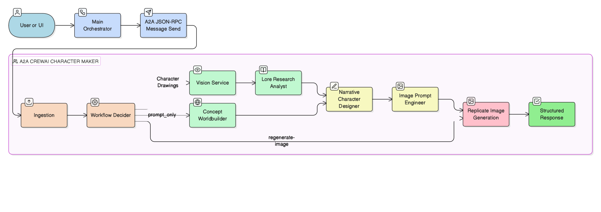

# Dream Backend: A2A CrewAI Character Maker

A self-contained multi-agent character engine that generates story-ready characters with identity consistency across scenes. Connects to the Main orchestrator (`backend/main-maf-chat`) through the A2A (Agent-to-Agent) Protocol.

**Pipeline:** User prompt + optional reference images -> OpenAI Vision analysis -> CrewAI backstory + image prompt generation -> Replicate image rendering -> structured JSON response.

**Models used**
- `gpt-4o-mini` (CrewAI): reasoning, synthesis, narrative generation
- `gpt-4.1-mini`: vision analysis of uploaded drawings/references
- `openai/gpt-image-1.5` (Replicate): final character image rendering

## Why This Microsoft Setup Matters

The character service is not where most of the Microsoft AI stack lives, but it still matters in the deployment architecture. Dream keeps character generation as a separate backend so it can evolve and scale without changing the orchestrator or website.

| Microsoft product | Why Dream uses it here | How Dream uses it here |
|---|---|---|
| Azure Container Apps | Character generation is a heavier specialist workload than a normal API proxy. It should stay independently deployable and scalable so image-generation work does not interfere with chat or website latency. | `dream-character-a2a` runs as its own Container App in `dream-env` and exposes `/health`, `/a2a`, and character-generation endpoints that the orchestrator can call over HTTPS. |
| Azure Container Registry | This service is shipped as a container and needs a predictable registry-backed release flow. That keeps revisions reproducible and makes updates consistent with the rest of the platform. | Character-service images are pushed to `dreamacr64808802c.azurecr.io`, and the `dream-character-a2a` Container App is updated to the selected image tag. |

### Architecture

<p align="center">
  
</p>

### Agent Roles

| Role | Workflow | Purpose |
|---|---|---|
| Lore Research Analyst | `reference_enriched` | Extracts worldbuilding facts, style cues, materials, era hints from references |
| Concept Worldbuilder | `prompt_only` | Expands raw prompts into concept scaffolding when no references provided |
| Narrative Character Designer | Both | Produces backstory with goals, flaws, turning points, visual signifiers |
| Generative Image Prompt Engineer | Both | Converts narrative + visual cues into production-grade image prompts |

### Workflow Selection

| Condition | Workflow | What Runs |
|---|---|---|
| References/drawings provided | `reference_enriched` | Vision -> Lore Analyst -> Narrative -> Prompt Eng -> Replicate |
| Prompt only, no references | `prompt_only` | Concept Worldbuilder -> Narrative -> Prompt Eng -> Replicate |
| Existing prompt, image regen | `regenerate-image` | Replicate only (skips CrewAI) |

Decision logic: `CharacterWorkflowDecider.choose_workflow(...)`.

## Setup

```bash
cd backend/a2a-crew-ai-character-maker
python3 -m venv .venv
source .venv/bin/activate
pip install -e .

# Dev extras (pytest)
pip install -e ".[dev]"
```

## Environment Variables

```bash
cp .env.example .env
```

| Variable | Required | Default | Description |
|---|---|---|---|
| `OPENAI_API_KEY` | Yes | — | OpenAI key for CrewAI + vision |
| `REPLICATE_API_TOKEN` | Yes | — | Replicate API token |
| `OPENAI_MODEL` | No | `openai/gpt-4o-mini` | Text model for CrewAI tasks |
| `OPENAI_TEMPERATURE` | No | `0.6` | Generation temperature |
| `OPENAI_VISION_MODEL` | No | `gpt-4.1-mini` | Vision model for image descriptions |
| `OPENAI_VISION_MAX_TOKENS` | No | `500` | Max vision output tokens |
| `REPLICATE_MODEL` | No | `openai/gpt-image-1.5` | Replicate image model |
| `REPLICATE_OUTPUT_COUNT` | No | `1` | Number of generated images |
| `REPLICATE_ASPECT_RATIO` | No | `2:3` | Image aspect ratio |
| `REPLICATE_QUALITY` | No | `medium` | Image quality level |
| `REPLICATE_BACKGROUND` | No | `auto` | Background handling |
| `REPLICATE_MODERATION` | No | `auto` | Content moderation |
| `REPLICATE_OUTPUT_FORMAT` | No | `webp` | Output image format |
| `REPLICATE_INPUT_FIDELITY` | No | `high` | Input fidelity level |
| `REPLICATE_OUTPUT_COMPRESSION` | No | `90` | Output compression (0-100) |
| `A2A_PUBLIC_BASE_URL` | No | `http://127.0.0.1:8000` | Public base URL for agent card |
| `A2A_RPC_PATH` | No | `/a2a` | A2A JSON-RPC endpoint path |
| `A2A_AGENT_NAME` | No | `Dream CrewAI Character Agent` | Agent card display name |
| `A2A_AGENT_VERSION` | No | `0.1.0` | Agent card version |
| `CREWAI_VERBOSE` | No | `true` | Enable CrewAI verbose logs |

## Run Locally

```bash
cd backend/a2a-crew-ai-character-maker
source .venv/bin/activate
uvicorn app.main:app --reload --host 127.0.0.1 --port 8000
```

Verify:

```bash
curl http://127.0.0.1:8000/health
# {"status":"ok"}
```

## Current Production Deployment

| Resource | Value |
|---|---|
| Resource Group | `dream-rg` |
| Container Apps Env | `dream-env` |
| ACR | `dreamacr64808802c.azurecr.io` |
| App Name | `dream-character-a2a` |
| App URL | `https://dream-character-a2a.greenplant-2d9bb135.eastus.azurecontainerapps.io` |
| Health | `https://dream-character-a2a.greenplant-2d9bb135.eastus.azurecontainerapps.io/health` |
| A2A RPC | `https://dream-character-a2a.greenplant-2d9bb135.eastus.azurecontainerapps.io/a2a` |
| Latest Revision | `dream-character-a2a--0000001` |
| Current Image | `dreamacr64808802c.azurecr.io/dream-character-a2a:latest` |
| Scale | `minReplicas=1`, `maxReplicas=3` |

### Subscription Limitations and Workarounds

This deployment was built around limitations of the Azure subscription.

| Limitation | Impact | Workaround |
|---|---|---|
| ACR Tasks blocked (`TasksOperationsNotAllowed`) | Cannot cloud-build images via `az acr build` | Build locally with Docker/Colima, push to ACR |
| Basic/Standard VM quota = 0 | Cannot create App Service plans (B1/S1) | Use Container Apps (consumption-based, no VM quota needed) |

If your subscription supports ACR Tasks, you can use:

```bash
./scripts/deploy_azure.sh
```

## Deploy to Azure

Build and deploy the character service with:

```bash
cd backend/a2a-crew-ai-character-maker
./scripts/deploy_azure.sh
```

Required deployment environment variables:

- `AZURE_SUBSCRIPTION_ID`
- `AZURE_RESOURCE_GROUP`
- `AZURE_LOCATION`
- `AZURE_CONTAINERAPP_ENV`
- `AZURE_ACR_NAME`
- `AZURE_CONTAINERAPP_NAME`
- `OPENAI_API_KEY`
- `REPLICATE_API_TOKEN`

Typical live Azure values:

- `AZURE_RESOURCE_GROUP=dream-rg`
- `AZURE_LOCATION=eastus`
- `AZURE_CONTAINERAPP_ENV=dream-env`
- `AZURE_ACR_NAME=dreamacr64808802c`
- `AZURE_CONTAINERAPP_NAME=dream-character-a2a`

Important optional deployment settings:

- `OPENAI_MODEL` defaults to `openai/gpt-4o-mini`
- `OPENAI_VISION_MODEL` defaults to `gpt-4.1-mini`
- `A2A_RPC_PATH` defaults to `/a2a`
- `AZURE_MIN_REPLICAS` defaults to `1`
- `AZURE_MAX_REPLICAS` defaults to `3`
- `AZURE_CONTAINER_CPU` defaults to `1.0`
- `AZURE_CONTAINER_MEMORY` defaults to `2Gi`

What the deploy script does:

1. Builds the character image in ACR.
2. Creates or updates the `dream-character-a2a` Container App.
3. Injects the OpenAI and Replicate secrets.
4. Sets the A2A runtime env vars for the public agent endpoint.
5. Keeps the app warm with `minReplicas=1`.

## API Reference

### Endpoints

| Method | Path | Description |
|---|---|---|
| `GET` | `/health` | Health check |
| `POST` | `/api/v1/characters/create` | Full pipeline: Vision -> CrewAI -> Replicate |
| `POST` | `/api/v1/characters/regenerate-image` | Replicate only (reuses existing prompt) |
| `POST` | `/a2a` | A2A JSON-RPC endpoint (`message/send`, `message/stream`) |
| `GET` | `/.well-known/agent.json` | A2A agent card |
| `GET` | `/docs` | Interactive API docs (Swagger) |

### Create Request

```json
{
  "user_prompt": "A young explorer with lantern and patchwork cloak in ancient ruins",
  "world_references": [
    {
      "title": "Moon temple archive",
      "description": "Flooded stone halls and bronze observatory machinery",
      "url": "https://...",
      "image_data": "data:image/jpeg;base64,..."
    }
  ],
  "character_drawings": [
    {
      "notes": "Front pose with satchel and rusted compass",
      "image_data": "data:image/png;base64,..."
    }
  ],
  "force_workflow": "reference_enriched"
}
```

### Regenerate Request

```json
{
  "positive_prompt": "story-ready keyframe portrait of a moon ranger...",
  "negative_prompt": "blurry, low detail, watermark, text artifacts",
  "world_references": [],
  "character_drawings": []
}
```

### Create Response

```json
{
  "workflow_used": "reference_enriched",
  "backstory": {
    "name": "string",
    "archetype": "string",
    "era": "string",
    "origin": "string",
    "goals": ["string"],
    "flaws": ["string"],
    "narrative_backstory": "string",
    "visual_signifiers": ["string"]
  },
  "image_prompt": {
    "positive_prompt": "string",
    "negative_prompt": "string",
    "composition_guidance": ["string"],
    "color_palette": ["string"],
    "lighting": "string"
  },
  "generated_images": ["https://..."],
  "drawing_descriptions": ["string"],
  "world_reference_descriptions": ["string"],
  "replicate_model": "openai/gpt-image-1.5",
  "reference_summary": {
    "key_facts": ["string"],
    "style_cues": ["string"],
    "source_links": ["string"],
    "research_notes": "string"
  }
}
```

### Regenerate Response

```json
{
  "image_prompt": {
    "positive_prompt": "string",
    "negative_prompt": "string"
  },
  "generated_images": ["https://..."],
  "replicate_model": "openai/gpt-image-1.5",
  "total_reference_images_sent": 2
}
```

### Error Codes

| Code | Meaning |
|---|---|
| `422` | Missing `user_prompt` / `positive_prompt` or invalid schema |
| `502` | Upstream failure in OpenAI/Replicate or workflow output error |
| `500` | Unhandled server exception |

## Quick Test Commands

Health:

```bash
curl http://127.0.0.1:8000/health
```

Agent card:

```bash
curl http://127.0.0.1:8000/.well-known/agent.json
```

A2A healthcheck (no model/image cost):

```bash
curl -X POST http://127.0.0.1:8000/a2a \
  -H "Content-Type: application/json" \
  -d '{
    "jsonrpc": "2.0",
    "id": "1",
    "method": "message/send",
    "params": {
      "message": {
        "role": "user",
        "parts": [{ "kind": "text", "text": "healthcheck" }],
        "messageId": "health-1",
        "metadata": { "operation": "healthcheck" }
      }
    }
  }'
```

Minimal character creation:

```bash
curl -X POST http://127.0.0.1:8000/api/v1/characters/create \
  -H "Content-Type: application/json" \
  -d '{"user_prompt": "A young explorer with lantern and patchwork cloak in ancient ruins"}'
```

## Run Tests

```bash
cd backend/a2a-crew-ai-character-maker
python -m pytest -q
```

## Troubleshooting

| Problem | Check |
|---|---|
| `Replicate generation failed` | Verify `REPLICATE_API_TOKEN`, model name, account limits |
| `Vision description failed` | Verify `OPENAI_API_KEY`, vision model access, `image_data` format |
| No image URLs in response | Inspect backend logs for upstream model errors |
| A2A `Method not found` | Use `message/send` (not `tasks/send`) - requires a2a-sdk >= 0.3.5 |
| ACR Tasks blocked | Build locally with Docker/Colima and push to ACR |
| App Service quota error | Use Container Apps instead (consumption-based) |
