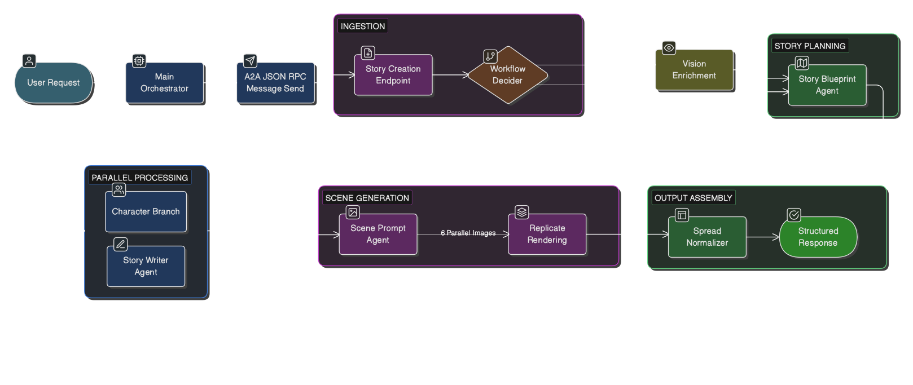

# Dream MAF Story Book Maker

A multi-agent storybook engine that generates illustrated storybooks with a fixed 12-spread contract (cover/title + 10 story pages + end spread). Built with Microsoft Agent Framework (MAF), it connects to the Character Maker via A2A, renders scene images through Replicate, and generates per-page MP3 narration via OpenAI.

**Pipeline:** User prompt + optional references → Vision enrichment → Story blueprint → Parallel character generation + story writing → Per-page MP3 narration → Scene prompts → Replicate image rendering → Normalized 12-spread output.

**Models used:**

- `gpt-4o-mini` (MAF agents) — story planning, writing, scene prompt generation
- `gpt-4.1-mini` — vision analysis of uploaded drawings/references
- `openai/gpt-image-1.5` (Replicate) — cover + 10 scene illustration rendering
- `gpt-4o-mini-tts` (OpenAI audio) — MP3 narration for each right-side story page

### Architecture

<p align="center">
  
</p>

### Agent Roles

| Agent | Purpose |
|-------|---------|
| StoryBlueprintAgent | Creates structured story plan (title, chapters, character briefs) from prompt |
| StoryWriterAgent | Writes 10 right-page chapter entries from the blueprint |
| ScenePromptAgent | Generates cover prompt + 10 illustration prompts for Replicate |
| Character Branch | Parallel A2A calls to Character Maker for each character brief |

### Pipeline Steps

| Step | What Happens |
|------|--------------|
| 1. Vision enrichment | Analyzes uploaded drawings/world references (optional, skipped if none) |
| 2. Story blueprint | MAF agent creates story plan + character briefs |
| 3. Parallel branches | Character generation (A2A) and story writing (MAF) run concurrently |
| 4. Audio narration | OpenAI generates per-page MP3 audio for right-side story pages |
| 5. Scene prompts | MAF agent generates cover + 10 illustration prompts |
| 6. Image rendering | Replicate renders all 11 images in parallel |
| 7. Normalization | Output shaped into fixed 12-spread contract |

### Spread Layout (Fixed Contract)

| Spread | Left | Right | Label |
|--------|------|-------|-------|
| 0 | Cover image | Title page | — |
| 1–10 | Illustration | Chapter text + `audio_url` | `Page N of 10` |
| 11 | End page | Empty | — |

### Workflow Selection

| Condition | Workflow |
|-----------|----------|
| References/drawings provided | `reference_enriched` — vision analysis feeds into blueprint |
| Prompt only, no references | `prompt_only` — blueprint generated directly from prompt |

## Setup

```bash
cd backend/a2a-maf-story-book-maker
python3 -m venv .venv
source .venv/bin/activate
pip install -r requirements.txt
```

## Environment Variables

```bash
cp .env.example .env
```

| Variable | Required | Default | Description |
|----------|----------|---------|-------------|
| `OPENAI_API_KEY` | Yes | — | OpenAI key for MAF agents + vision |
| `REPLICATE_API_TOKEN` | Yes | — | Replicate API token |
| `OPENAI_MODEL` | No | `gpt-4o-mini` | Text model for MAF agents |
| `OPENAI_TEMPERATURE` | No | `0.5` | Generation temperature |
| `OPENAI_VISION_MODEL` | No | `gpt-4.1-mini` | Vision model for image descriptions |
| `OPENAI_VISION_MAX_TOKENS` | No | `500` | Max vision output tokens |
| `STORY_AUDIO_ENABLED` | No | `true` | Enable per-page MP3 narration generation |
| `OPENAI_TTS_MODEL` | No | `gpt-4o-mini-tts` | OpenAI TTS model for story narration |
| `OPENAI_TTS_VOICE` | No | `alloy` | OpenAI TTS voice |
| `OPENAI_TTS_RESPONSE_FORMAT` | No | `mp3` | Story narration output format |
| `OPENAI_TTS_SPEED` | No | `1.0` | Story narration speed |
| `REPLICATE_MODEL` | No | `openai/gpt-image-1.5` | Replicate image model |
| `REPLICATE_OUTPUT_COUNT` | No | `1` | Images per scene |
| `REPLICATE_ASPECT_RATIO` | No | `2:3` | Image aspect ratio |
| `REPLICATE_QUALITY` | No | `medium` | Image quality level |
| `REPLICATE_BACKGROUND` | No | `auto` | Background handling |
| `REPLICATE_MODERATION` | No | `auto` | Content moderation |
| `REPLICATE_OUTPUT_FORMAT` | No | `webp` | Output image format |
| `REPLICATE_INPUT_FIDELITY` | No | `high` | Input fidelity level |
| `REPLICATE_OUTPUT_COMPRESSION` | No | `90` | Output compression (0–100) |
| `SCENE_IMAGE_TIMEOUT_SECONDS` | No | `70` | Per-scene image generation timeout in seconds |
| `SCENE_IMAGE_RETRY_COUNT` | No | `1` | Retries after a failed/timed-out scene image generation |
| `CHARACTER_BACKEND_BASE_URL` | No | `http://127.0.0.1:8000` | Character Maker backend URL |
| `CHARACTER_BACKEND_RPC_PATH` | No | `/a2a` | Character Maker A2A RPC path |
| `CHARACTER_BACKEND_USE_PROTOCOL` | No | `true` | Use A2A protocol for character calls |
| `CHARACTER_BACKEND_TIMEOUT_SECONDS` | No | `240` | Timeout for character generation |
| `A2A_PUBLIC_BASE_URL` | No | `http://127.0.0.1:8020` | Public base URL for agent card |
| `A2A_RPC_PATH` | No | `/a2a` | A2A JSON-RPC endpoint path |
| `A2A_AGENT_NAME` | No | `Dream MAF Story Book Agent` | Agent card display name |
| `A2A_AGENT_VERSION` | No | `0.1.0` | Agent card version |

**Model ID note:** Use raw OpenAI model IDs (`gpt-4o-mini`), not provider-prefixed (`openai/gpt-4o-mini`).

## Run Locally

```bash
cd backend/a2a-maf-story-book-maker
source .venv/bin/activate
uvicorn agent_storybook.main:app --reload --host 127.0.0.1 --port 8020
```

Verify:

```bash
curl http://127.0.0.1:8020/health
```

## API Reference

### Endpoints

| Method | Path | Description |
|--------|------|-------------|
| `GET` | `/health` | Health check + character backend connectivity |
| `POST` | `/api/v1/stories/create` | Full storybook pipeline |
| `POST` | `/a2a` | A2A JSON-RPC endpoint (`message/send`, `message/stream`) |
| `GET` | `/.well-known/agent.json` | A2A agent card |
| `GET` | `/docs` | Interactive API docs (Swagger) |

### Create Request

```json
{
  "user_prompt": "A moon explorer rescues a lost archive",
  "world_references": [
    {
      "title": "Orbital temple",
      "description": "Flooded silver halls",
      "image_data": "data:image/png;base64,..."
    }
  ],
  "character_drawings": [
    {
      "notes": "front pose",
      "image_data": "data:image/png;base64,..."
    }
  ],
  "force_workflow": "reference_enriched",
  "max_characters": 2,
  "tone": "hopeful",
  "age_band": "5-8"
}
```

### Response

```json
{
  "workflow_used": "reference_enriched",
  "story": {
    "title": "...",
    "title_page_text": "...",
    "right_pages": [
      { "page_number": 1, "chapter": "Chapter 1", "text": "..." }
    ],
    "end_page_text": "..."
  },
  "characters": [
    {
      "name": "...",
      "brief": "...",
      "backstory": { "...": "..." },
      "image_prompt": { "...": "..." },
      "generated_images": ["https://..."]
    }
  ],
  "scene_prompts": {
    "cover_prompt": "...",
    "illustration_prompts": ["...", "...", "...", "...", "..."],
    "negative_prompt": "..."
  },
  "generated_images": ["cover", "p1", "p2", "p3", "p4", "p5"],
  "spreads": [
    { "spread_index": 0, "left": { "kind": "cover_image" }, "right": { "kind": "title_page" } }
  ],
  "generation_sources": {
    "blueprint": "maf",
    "story": "maf",
    "scene_prompts": "maf",
    "character_branch": "parallel_success"
  },
  "reference_images_used_count": 3,
  "warnings": []
}
```

### Error Codes

| Code | Meaning |
|------|---------|
| `422` | Missing `user_prompt` or invalid schema |
| `502` | Upstream failure in OpenAI/Replicate/Character backend |
| `500` | Unhandled server exception |

## Quick Test Commands

Health:

```bash
curl http://127.0.0.1:8020/health
```

Agent card:

```bash
curl http://127.0.0.1:8020/.well-known/agent.json
```

Direct storybook creation:

```bash
curl -X POST http://127.0.0.1:8020/api/v1/stories/create \
  -H "Content-Type: application/json" \
  -d '{
    "user_prompt": "A moon explorer rescues a lost archive",
    "max_characters": 2,
    "world_references": [],
    "character_drawings": []
  }'
```

A2A storybook creation:

```bash
curl -X POST http://127.0.0.1:8020/a2a \
  -H "Content-Type: application/json" \
  -d '{
    "jsonrpc": "2.0",
    "id": "story-1",
    "method": "message/send",
    "params": {
      "message": {
        "role": "user",
        "parts": [{ "kind": "text", "text": "Create a short moon adventure storybook" }],
        "messageId": "story-msg-1",
        "metadata": {
          "operation": "story_create",
          "payload": {
            "user_prompt": "Create a short moon adventure storybook",
            "max_characters": 2,
            "world_references": [],
            "character_drawings": []
          }
        }
      }
    }
  }'
```

## Run Tests

```bash
cd backend/a2a-maf-story-book-maker
python -m pytest -q
```

## Troubleshooting

| Problem | Check |
|---------|-------|
| `Replicate generation failed` | Verify `REPLICATE_API_TOKEN`, model name, account limits |
| `Vision description failed` | Verify `OPENAI_API_KEY`, vision model access, `image_data` format |
| Character generation timeout | Increase `CHARACTER_BACKEND_TIMEOUT_SECONDS`, check character backend health |
| A2A `Method not found` | Use `message/send` (not `tasks/send`) — requires a2a-sdk >= 0.3.5 |
| Empty story output | Check MAF agent logs, verify `OPENAI_MODEL` is a valid raw model ID |
| Character backend unreachable | Verify `CHARACTER_BACKEND_BASE_URL` and that the character service is running |
