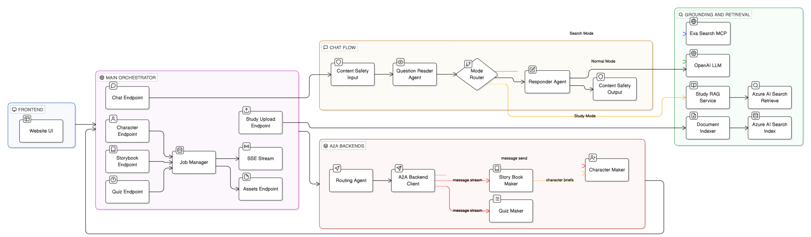

# Dream MAF Orchestrator

Dream MAF Orchestrator is the coordination layer for the Dream platform. It sits between the frontend and the specialist backends, uses **Microsoft Agent Framework (MAF)** for kid-safe chat and routing decisions, uses **Exa MCP** for fresh web grounding, adds a **retrieval-augmented generation (RAG)** path through **Azure AI Search** for study-mode answers over uploaded PDFs, and sends character and storybook requests to downstream services over the **A2A** protocol.

**Pipeline:** Incoming request -> MAF chat or routing agents -> optional retrieval and grounding -> A2A calls to specialist backends -> job tracking and asset storage -> structured API response.

**Core components used:**

- `gpt-4o-mini` - powers MAF agents for question classification, kid-safe answering, and character routing
- Exa MCP (`web_search_exa`) - provides fresh web retrieval for chat `mode=search`
- Azure AI Search study index (`mode=study`) - provides the RAG retrieval layer for uploaded PDF study sessions


### Architecture



## How It Works

This service sits between the Next.js frontend and the two specialist backends. Every request that arrives here passes through at least one MAF agent before any backend call is made. Nothing is proxied blindly — every route has explicit agent-driven logic.

### 1. Kid-Safe Chat (`/api/v1/orchestrate/chat`)

Two MAF agents handle every chat message in sequence.

`QuestionReaderAgent` (`dream-kid-question-reader`) reads the latest user message together with recent conversation history and classifies it by category, safety level, reading level, response style, and a short reasoning note. That structured output is then passed to `ResponderAgent` (`dream-kid-response-agent`).

`ResponderAgent` uses the classification plus the original message to generate a 60-140 word reply in warm, concrete, kid-safe language. If the message is unsafe, it refuses gently and suggests involving a trusted adult. If the message needs caution, it answers with supportive guidance. In `mode=search`, it grounds the answer with fresh web evidence from Exa MCP. In `mode=study`, it grounds the answer with evidence retrieved from uploaded PDFs through Azure AI Search.

**Normal mode** (`mode=normal`) — both agents run against OpenAI directly, no external calls beyond the LLM.

**Search mode** (`mode=search`) — retrieval uses Exa MCP (`web_search_exa`) for fresh internet results.

**Study mode** (`mode=study`) — retrieval uses Azure AI Search filtered by `study_session_id` so answers are grounded to user-uploaded PDFs only.

In practice, the frontend first uploads PDFs for a study session and receives a `study_session_id`. Later chat requests send that same `study_session_id` with `mode=study`, and the orchestrator searches only the chunks indexed for that session. This keeps the answer scoped to the learner's uploaded material instead of the open web.

Retrieved evidence and citations are injected into the responder prompt as mode-specific grounding context, so the final reply is based on the uploaded study content and can return source-backed references in the API response.

**Temporal queries** (e.g. "what is today's date?") are intercepted before the Responder. The server clock is injected as authoritative context and, if the LLM omits the ISO date in its reply, a deterministic correction is applied so the answer is always accurate.

**MCP failure handling** — Exa MCP diagnostics are surfaced in `mcp_output.errors`. If `EXA_MCP_REQUIRED_IN_SEARCH=true`, the request fails when no Exa evidence is returned.

---

### 2. Character Orchestration (`/api/v1/orchestrate/character`)

Character requests support three modes: `auto`, `create`, and `regenerate`. When the mode is explicitly set to `create` or `regenerate`, the service routes immediately without calling an LLM. When the mode is `auto`, `MAFRoutingAgent` (`dream-character-router`) reads the request payload and returns a structured decision containing the selected action, a short rationale, and a confidence score.

If the routing agent is unavailable or its JSON output cannot be parsed, the service falls back to a deterministic rule: requests with `positive_prompt` are treated as `regenerate`, and requests without it are treated as `create`.

After the action is resolved, `A2ABackendClient` sends the request to the Character Maker over A2A JSON-RPC at `http://<A2A_BACKEND_BASE_URL>/a2a`.

If a `job_id` query parameter is present, the orchestration layer records progress events in SQLite for each major step, including routing, backend call, generation, asset download, and final completion or failure. Downloaded character images are stored under `data/{job_id}/`.

**Why a routing agent?** The same endpoint accepts both full character creation (Vision → CrewAI → Replicate) and image-only regeneration. Using an MAF agent to make the decision means the routing logic can be adjusted by updating a prompt, not by changing code.

---

### 3. Storybook Orchestration (`/api/v1/orchestrate/storybook` and `/stream`)

Storybook requests can run in two ways: a blocking request through `A2ABackendClient.create_storybook()` or a streaming request through `A2ABackendClient.stream_storybook_operation()`. Both paths call the Story Book Maker backend at `A2A_STORY_BACKEND_BASE_URL` over A2A.

For streaming requests, the orchestrator forwards NDJSON events in real time. `status` events are passed through directly, `progress` events are forwarded and also written to the job log, `update` events are inspected and promoted to `progress` when they contain nested progress data, and `final` events trigger result extraction, asset download, and job completion.

If a `job_id` is provided, the full progress trail is stored in SQLite and can be streamed to the frontend through `/api/v1/jobs/{id}/stream` over SSE.

---

### 4. Job Tracking + Asset Storage

Every character and storybook request can carry an optional `job_id` query param. When present:

1. A job record in SQLite transitions through states: `queued → processing → completed / failed`
2. Progress events are written at each pipeline step (step name, message, `0–100%` progress float)
3. A real-time SSE bus at `/api/v1/jobs/{job_id}/stream` pushes events to the frontend as they are written
4. After the backend responds, image URLs are downloaded and stored locally under `data/{job_id}/` so the UI can load them without hitting external URLs again
5. The job record is finalised with the full `result_payload` and a human-readable title extracted from the response

Jobs are created separately via `POST /api/v1/jobs` before the orchestration call, so the frontend can render a loading state immediately.

---

### 5. MAF + MCP + A2A: Why All Three?

| Layer | What It Provides |
|-------|-----------------|
| **MAF** (`agent-framework-core`) | Structured `Agent` abstraction over OpenAI/Azure. Agents have names, system instructions, and run against a typed LLM client. No raw `openai.chat.completions` calls anywhere in this service. |
| **MCP** (`mcp==1.24.0`) | Standard protocol for giving agents access to external tools at runtime. Search mode uses Exa MCP for web retrieval; study mode uses Azure Search REST retrieval over indexed PDF chunks. |
| **A2A** (`a2a-sdk==0.3.5`) | Standard agent-to-agent call protocol. All calls to character and storybook backends use `message/send` JSON-RPC, not direct HTTP. This keeps backends independently deployable and replaceable without changing this service. |

---

### Agent Roles

| Agent | Name | Purpose |
|-------|------|---------|
| QuestionReaderAgent | `dream-kid-question-reader` | Classifies kid questions by category, safety level, reading level, and response style |
| ResponderAgent | `dream-kid-response-agent` | Generates kid-safe answer; uses Exa retrieval in `mode=search` and Azure study retrieval in `mode=study` |
| MAFRoutingAgent | `dream-character-router` | Routes character requests to `create` (full pipeline) or `regenerate` (image-only) |

### Routing Logic

| Request Type | Agent Path | Destination |
|---|---|---|
| Chat — `mode=normal` | QuestionReader + Responder MAF agents | OpenAI |
| Chat — `mode=search` | QuestionReader + Responder MAF agents + Exa MCP retrieval | OpenAI + Exa |
| Chat — `mode=study` | QuestionReader + Responder MAF agents + Azure Search study retrieval | OpenAI + Azure AI Search |
| Character — `mode=create` | MAF Router agent → A2A | Character Maker (`:8000`) |
| Character — `mode=regenerate` | MAF Router agent → A2A | Character Maker (`:8000`) |
| Character — `mode=auto` | MAF Router agent decides → A2A | Character Maker (`:8000`) |
| Storybook | A2A passthrough | Story Book Maker (`:8020`) |
| Storybook stream | A2A streaming (NDJSON) | Story Book Maker (`:8020`) |

### A2A Protocol Guarantee

`A2A_USE_PROTOCOL` and `A2A_STORY_USE_PROTOCOL` are validated at startup — the service **refuses to start** if either is `false`. Soft-API fallback is not supported.

## Setup

```bash
cd backend/main-maf-chat
python3 -m venv .venv
source .venv/bin/activate
pip install -r requirements.txt
```

## Environment Variables

```bash
cp .env.example .env
```

| Variable | Required | Default | Description |
|----------|----------|---------|-------------|
| `AGENT_PROVIDER` | No | `openai` | LLM provider: `openai` or `azure` |
| `OPENAI_API_KEY` | Yes (openai) | — | OpenAI API key for MAF agents |
| `OPENAI_MODEL` | No | `gpt-4o-mini` | Text model for all MAF agents |
| `AZURE_OPENAI_ENDPOINT` | Yes (azure) | — | Azure OpenAI resource endpoint |
| `AZURE_OPENAI_API_KEY` | Yes (azure) | — | Azure OpenAI API key |
| `AZURE_OPENAI_CHAT_DEPLOYMENT_NAME` | Yes (azure) | — | Deployment name for chat model |
| `AZURE_OPENAI_API_VERSION` | No | `preview` | Azure API version string |
| `APPLICATIONINSIGHTS_CONNECTION_STRING` | No | — | Enables Azure Monitor OpenTelemetry export when provided |
| `EXA_API_KEY` | Yes (search mode) | — | Exa API key used by Exa MCP retrieval |
| `EXA_MCP_ENABLED` | No | `true` | Enable Exa MCP retrieval path |
| `EXA_MCP_BASE_URL` | No | `https://mcp.exa.ai/mcp` | Exa MCP endpoint |
| `EXA_MCP_TOOLS` | No | `web_search_exa` | Tool scope/query for Exa MCP |
| `EXA_MCP_REQUIRED_IN_SEARCH` | No | `true` | Fail `mode=search` if Exa MCP is unavailable or returns no evidence |
| `EXA_MCP_TIMEOUT_SECONDS` | No | `20` | Exa MCP request timeout |
| `EXA_SEARCH_TOP_K` | No | `6` | Max retained Exa citations |
| `AZURE_SEARCH_SERVICE_ENDPOINT` | No | — | Azure AI Search service endpoint |
| `AZURE_SEARCH_API_KEY` | No | — | Azure AI Search key (optional when managed identity is enabled) |
| `AZURE_SEARCH_USE_MANAGED_IDENTITY` | No | `false` | Use managed identity token instead of API key for Azure Search |
| `AZURE_SEARCH_INDEX_NAME` | No | — | Default Azure AI Search index name |
| `AZURE_SEARCH_KNOWLEDGE_BASE_NAME` | No | — | Optional legacy knowledge-base MCP name (not required for search mode) |
| `AZURE_SEARCH_MCP_ENABLED` | No | `true` | Legacy Azure MCP toggle (kept for compatibility) |
| `AZURE_SEARCH_FALLBACK_ENABLED` | No | `true` | Enable Azure Search hybrid + semantic fallback retrieval |
| `AZURE_SEARCH_API_VERSION` | No | `2025-09-01` | Azure Search GA REST API version for fallback retrieval |
| `AZURE_SEARCH_MCP_API_VERSION` | No | `2025-11-01-preview` | Azure Search MCP endpoint API version |
| `AZURE_SEARCH_TOP_K` | No | `6` | Number of citations/snippets retained from retrieval |
| `AZURE_SEARCH_VECTOR_K` | No | `20` | Number of vector neighbors used in hybrid query |
| `AZURE_SEARCH_STUDY_ENABLED` | No | `true` | Enable Azure study-mode retrieval/indexing |
| `AZURE_SEARCH_STUDY_INDEX_NAME` | No | — | Dedicated index for uploaded-study chunks (falls back to `AZURE_SEARCH_INDEX_NAME`) |
| `AZURE_SEARCH_STUDY_SESSION_FIELD` | No | `study_session_id` | Field used to isolate one study session |
| `AZURE_SEARCH_STUDY_CONTENT_FIELD` | No | `content` | Field where chunk text is stored |
| `AZURE_SEARCH_STUDY_TITLE_FIELD` | No | `title` | Field for original filename/title |
| `AZURE_SEARCH_STUDY_MAX_FILE_BYTES` | No | `20000000` | Max upload size for one PDF |
| `AZURE_CONTENT_SAFETY_ENABLED` | No | `false` | Enable Azure AI Content Safety checks for chat I/O |
| `AZURE_CONTENT_SAFETY_ENDPOINT` | No | — | Azure AI Content Safety endpoint |
| `AZURE_CONTENT_SAFETY_API_KEY` | No | — | Azure AI Content Safety API key |
| `AZURE_CONTENT_SAFETY_API_VERSION` | No | `2024-09-01` | Content Safety API version |
| `AZURE_CONTENT_SAFETY_BLOCK_SEVERITY` | No | `4` | Block threshold for category severities |
| `AZURE_CONTENT_SAFETY_FAIL_OPEN` | No | `true` | If Content Safety call fails, allow response and record error metadata |
| `A2A_BACKEND_BASE_URL` | No | `http://127.0.0.1:8000` | Character Maker backend URL |
| `A2A_RPC_PATH` | No | `/a2a` | Character backend A2A RPC path |
| `A2A_USE_PROTOCOL` | No | `true` | Must remain `true` — enforced by startup validator |
| `A2A_STORY_BACKEND_BASE_URL` | No | `http://127.0.0.1:8020` | Story Book Maker backend URL |
| `A2A_STORY_RPC_PATH` | No | `/a2a` | Story backend A2A RPC path |
| `A2A_STORY_USE_PROTOCOL` | No | `true` | Must remain `true` — enforced by startup validator |
| `A2A_TIMEOUT_SECONDS` | No | `240` | Timeout for all A2A backend calls |
| `DREAM_DATA_DIR` | No | `./data` | Directory for SQLite DB and downloaded job assets |

**Model ID note:** Use raw OpenAI model IDs (`gpt-4o-mini`), not provider-prefixed IDs like `openai/gpt-4o-mini`.

## Run Locally

Start all three backends in order:

### 1) Character backend (port 8000)

```bash
cd backend/a2a-crew-ai-character-maker
source .venv/bin/activate
uvicorn app.main:app --reload --host 127.0.0.1 --port 8000
```

### 2) Storybook backend (port 8020)

```bash
cd backend/a2a-maf-story-book-maker
source .venv/bin/activate
uvicorn agent_storybook.main:app --reload --host 127.0.0.1 --port 8020
```

### 3) Main orchestrator (port 8010)

```bash
cd backend/main-maf-chat
source .venv/bin/activate
uvicorn agent_orchestrator.main:app --reload --host 127.0.0.1 --port 8010
```

Verify:

```bash
curl http://127.0.0.1:8010/health
```

## Deploy to Azure

Build and deploy to Azure Container Apps using ACR:

```bash
export AZURE_SUBSCRIPTION_ID=...
export AZURE_RESOURCE_GROUP=dream-rg
export AZURE_LOCATION=eastus
export AZURE_CONTAINERAPP_ENV=dream-env
export AZURE_ACR_NAME=dreamacr...
export AZURE_CONTAINERAPP_NAME=dream-main-orchestrator
export OPENAI_API_KEY=...
export REPLICATE_API_TOKEN=...
export A2A_BACKEND_BASE_URL=https://dream-character-a2a....azurecontainerapps.io
export A2A_STORY_BACKEND_BASE_URL=https://dream-storybook-a2a....azurecontainerapps.io

./scripts/deploy_azure.sh
```

| Resource | Value |
|---|---|
| Target port | `8080` |
| CPU / Memory | `1.0 vCPU / 2 Gi` |
| Min / Max replicas | `1 / 3` |
| Ingress | External (HTTPS) |

### Subscription Limitations and Workarounds

| Limitation | Impact | Workaround |
|---|---|---|
| ACR Tasks blocked (`TasksOperationsNotAllowed`) | Cannot cloud-build images via `az acr build` | Build locally with Docker/Colima, push to ACR |
| Basic/Standard VM quota = 0 | Cannot create App Service plans (B1/S1) | Use Container Apps (consumption-based, no VM quota needed) |

If your subscription supports ACR Tasks, you can use:

```bash
./scripts/deploy_azure.sh
```

## API Reference

### Endpoints

| Method | Path | Description |
|--------|------|-------------|
| `GET` | `/health` | Service health + character backend connectivity snapshot |
| `GET` | `/api/v1/orchestrate/a2a-health` | A2A health probe for character backend |
| `GET` | `/api/v1/orchestrate/storybook-health` | A2A health probe for storybook backend |
| `POST` | `/api/v1/orchestrate/chat` | Kid-safe chat — MAF agents + Azure AI Search retrieval |
| `POST` | `/api/v1/orchestrate/character` | Character creation/regeneration via MAF router + A2A |
| `POST` | `/api/v1/orchestrate/storybook` | Storybook creation passthrough via A2A |
| `POST` | `/api/v1/orchestrate/storybook/stream` | Streaming storybook creation (NDJSON) |
| `POST` | `/api/v1/jobs` | Create a tracked job record |
| `GET` | `/api/v1/jobs` | List jobs (filterable by `type`, `status`, `limit`, `offset`) |
| `GET` | `/api/v1/jobs/{job_id}` | Get full job details + assets |
| `GET` | `/api/v1/jobs/{job_id}/events` | Get job event log |
| `GET` | `/api/v1/jobs/{job_id}/stream` | SSE stream of live job events |
| `GET` | `/api/v1/assets/{job_id}/{filename}` | Serve a downloaded job asset file |
| `GET` | `/docs` | Interactive API docs (Swagger) |

### Chat Request

```json
{
  "message": "Why is the sky blue?",
  "history": [
    { "role": "user", "content": "What is the sun?" },
    { "role": "assistant", "content": "The sun is a giant ball of hot gas..." }
  ],
  "age_band": "5-8",
  "mode": "normal"
}
```

`mode` options: `normal` (MAF agents only), `search` (MAF agents + Exa MCP web retrieval), `study` (MAF agents + Azure study-session retrieval).

### Chat Response

```json
{
  "answer": "The sky looks blue because sunlight scatters...",
  "category": "learning",
  "safety": "safe",
  "reading_level": "5-7",
  "response_style": "explainer",
  "model": "gpt-4o-mini",
  "mcp_used": true,
  "mcp_server": "https://mcp.exa.ai/mcp?tools=web_search_exa",
  "mcp_output": {
    "provider": "exa_mcp",
    "used_fallback": false,
    "input": { "query": "latest science news for kids" },
    "output": "..."
  }
}
```

`mcp_used` is `true` only when Exa MCP returned evidence in `mode=search`. In `mode=study`, retrieval metadata is reported through `retrieval_provider=azure_search_study` and standard `citations`.

### Study Upload Endpoint

`POST /api/v1/orchestrate/study/upload` accepts multipart form-data:

- `file`: PDF file
- `session_id` (optional): existing study session id to append more files

Response includes `session_id`, `file_id`, and `chunks_indexed`. Pass `study_session_id` in subsequent `/api/v1/orchestrate/chat` requests with `mode=study`.

### Character Request

```json
{
  "mode": "auto",
  "user_prompt": "A relic hunter from submerged moon ruins",
  "world_references": [
    {
      "title": "Moon temple archive",
      "description": "Flooded stone halls",
      "image_data": "data:image/png;base64,..."
    }
  ],
  "character_drawings": [],
  "force_workflow": null
}
```

`mode` options: `auto` (MAF routing agent decides), `create` (force full pipeline), `regenerate` (image-only, requires `positive_prompt`).

### Character Response

```json
{
  "selected_action": "create",
  "selected_by": "agent",
  "agent_reasoning": "user_prompt present, no positive_prompt — full create path selected.",
  "agent_raw_output": "{ \"selected_action\": \"create\", \"rationale\": \"...\", \"confidence\": 0.95 }",
  "backend_endpoint": "https://dream-character-a2a.../api/v1/characters/create",
  "backend_status_code": 200,
  "backend_response": { "workflow_used": "reference_enriched", "backstory": { "...": "..." } }
}
```

`selected_by` values: `agent` (MAF router decided), `explicit_mode` (caller set `mode` directly), `rule_fallback` (MAF unavailable, rule logic used).

### Storybook Request

```json
{
  "user_prompt": "A moon explorer rescues a lost archive",
  "world_references": [],
  "character_drawings": [],
  "force_workflow": null,
  "max_characters": 2,
  "tone": "hopeful",
  "age_band": "5-8"
}
```

### Job Create Request

```json
{
  "type": "character",
  "title": "Moon Relic Hunter",
  "user_prompt": "A relic hunter from submerged moon ruins",
  "input_payload": {},
  "triggered_by": "user",
  "engine": "crewai"
}
```

`type` options: `character`, `story`, `video`.

### Error Codes

| Code | Meaning |
|------|---------|
| `422` | Invalid request schema or missing required field |
| `502` | Upstream failure — OpenAI/Azure OpenAI, Azure Search retrieval, character backend, or storybook backend |
| `500` | Unhandled server exception |

## Quick Test Commands

Health:

```bash
curl http://127.0.0.1:8010/health
```

Character A2A health:

```bash
curl http://127.0.0.1:8010/api/v1/orchestrate/a2a-health
```

Storybook A2A health:

```bash
curl http://127.0.0.1:8010/api/v1/orchestrate/storybook-health
```

Kid-safe chat (normal mode):

```bash
curl -X POST http://127.0.0.1:8010/api/v1/orchestrate/chat \
  -H "Content-Type: application/json" \
  -d '{
    "message": "Why is the sky blue?",
    "history": [],
    "age_band": "5-8",
    "mode": "normal"
  }'
```

Kid-safe chat (search mode — Exa MCP web retrieval):

```bash
curl -X POST http://127.0.0.1:8010/api/v1/orchestrate/chat \
  -H "Content-Type: application/json" \
  -d '{
    "message": "What is the latest news about Mars exploration?",
    "history": [],
    "age_band": "8-10",
    "mode": "search"
  }'
```

Kid-safe chat (study mode — Azure Search over uploaded PDFs):

```bash
curl -X POST http://127.0.0.1:8010/api/v1/orchestrate/chat \
  -H "Content-Type: application/json" \
  -d '{
    "message": "Summarize chapter 2 from my uploaded notes.",
    "history": [],
    "age_band": "8-10",
    "mode": "study",
    "study_session_id": "your-session-id"
  }'
```

Character creation via main:

```bash
curl -X POST http://127.0.0.1:8010/api/v1/orchestrate/character \
  -H "Content-Type: application/json" \
  -d '{
    "mode": "create",
    "user_prompt": "A relic hunter from submerged moon ruins",
    "world_references": [],
    "character_drawings": []
  }'
```

Storybook creation via main:

```bash
curl -X POST http://127.0.0.1:8010/api/v1/orchestrate/storybook \
  -H "Content-Type: application/json" \
  -d '{
    "user_prompt": "A moon explorer rescues a lost archive",
    "world_references": [],
    "character_drawings": [],
    "max_characters": 2,
    "tone": "hopeful",
    "age_band": "5-8"
  }'
```

List recent jobs:

```bash
curl "http://127.0.0.1:8010/api/v1/jobs?type=character&limit=10"
```

Stream job events:

```bash
curl -N "http://127.0.0.1:8010/api/v1/jobs/{job_id}/stream"
```

## Troubleshooting

| Problem | Check |
|---------|-------|
| `OPENAI_API_KEY is required` | Set `OPENAI_API_KEY` in `.env` or confirm `AGENT_PROVIDER` matches provided credentials |
| `A2A-only mode: A2A_USE_PROTOCOL must be true` | Do not set `A2A_USE_PROTOCOL=false` — enforced at startup and cannot be bypassed |
| Search mode has no citations | Verify `AZURE_SEARCH_SERVICE_ENDPOINT`, `AZURE_SEARCH_KNOWLEDGE_BASE_NAME`, and `AZURE_SEARCH_INDEX_NAME` are set |
| Azure Search auth error | Use `AZURE_SEARCH_API_KEY` or set `AZURE_SEARCH_USE_MANAGED_IDENTITY=true` and assign search roles to container app identity |
| Content Safety call failures | Check `AZURE_CONTENT_SAFETY_ENDPOINT` and `AZURE_CONTENT_SAFETY_API_KEY`; set `AZURE_CONTENT_SAFETY_FAIL_OPEN=true` during dev |
| `Chat responder failed` | Check `OPENAI_API_KEY`, model access, and OpenAI quota |
| `A2ABackendError` on character requests | Verify character backend is running at `A2A_BACKEND_BASE_URL` |
| `A2ABackendError` on storybook requests | Verify storybook backend is running at `A2A_STORY_BACKEND_BASE_URL` |
| `MAF import unavailable` | Reinstall dependencies: `pip install -r requirements.txt` |
| Jobs stuck in `processing` | Check SSE stream at `/api/v1/jobs/{id}/stream` for error events |
| Asset 404 on `/api/v1/assets/...` | Verify `DREAM_DATA_DIR` is writable and assets were downloaded during job completion |
| ACR Tasks blocked on deploy | Build locally with Docker/Colima and push to ACR manually |

## Dependencies

Pinned in `requirements.txt`:

| Package | Version | Purpose |
|---------|---------|---------|
| `agent-framework-core` | `1.0.0rc1` | MAF `Agent` class + OpenAI/Azure LLM clients |
| `agent-framework-a2a` | `1.0.0b260219` | MAF A2A transport layer |
| `mcp` | `1.24.0` | MCP protocol client (`MCPStreamableHTTPTool` for Azure Search Knowledge Base MCP) |
| `a2a-sdk` | `0.3.5` | A2A JSON-RPC protocol (`message/send`, `message/stream`) |
| `aiosqlite` | `0.21.0` | Async SQLite for job tracking |
| `fastapi` | `0.133.0` | Web framework |
| `uvicorn[standard]` | `0.41.0` | ASGI server |
